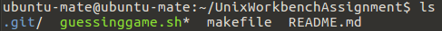

# This is a demo repository

## First attempts at learning Git and GitHub


A test for *italic* and **bold**.

- This is
- an unordered
- list

1. This is
2. an ordered
3. list

Here is `some code` in the middle of a sentence.

```
This is
a block
of code
```

Here is how you make [a link](https://www.wikipedia.org/).


